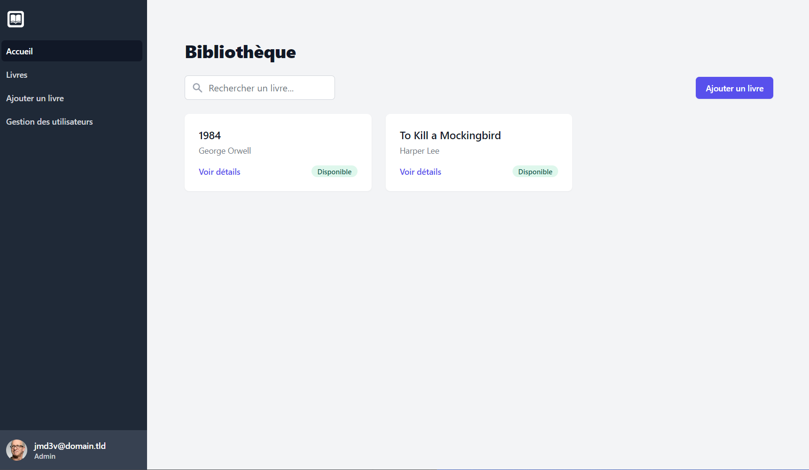
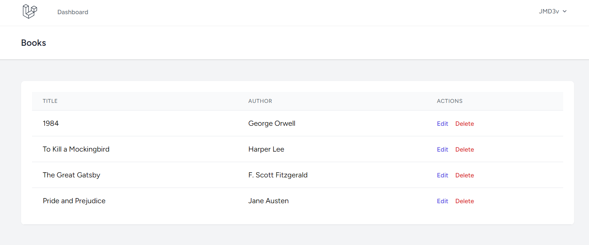

+++
title = "Building an MVP with AI: A Security Engineer's Journey"
date = 2024-09-13T10:00:00+02:00
draft = false
+++

As a security engineer, I often have to read code in various languages, but that doesn’t necessarily make me a developer. On a day-to-day basis, I use Ruby, and when I need to build a web application, I naturally turn to Ruby on Rails.

Most of the time, I’m building APIs, and for that, I love this framework. However, I’ve found myself increasingly needing to build projects with a UI, and that’s where my frustration with Ruby on Rails begins.

Over the course of three major versions, the way Rails handles assets (CSS & JS) has changed three times. When searching for solutions or troubleshooting, you’re often faced with a myriad of answers that may not correspond to the version you’re using. Just this week, I encountered a CSS issue that I couldn’t resolve, despite extensive searching and even using ChatGPT. It seemed like a basic task, yet it remained unsolved and I was able to find different StackOverflow topics discussing the same problem (unresolved).

This experience prompted me to explore other options and consider learning a new framework. I also wondered if an AI model could autonomously create an entire project for me.

When it comes to using AI for coding, I sometimes use ChatGPT to ask questions, get explanations, or make suggestions on code snippets. However, I’ve never used it—or any other model—to generate complete code, let alone full projects.

For this experiment, I decided to pit ChatGPT against Claude AI. After some research, I had both models build different projects to assess:

  * Which language works best
  * Which framework meets my needs

Given the abundance of frameworks for different languages, I narrowed the list to three:

  * Ruby on Rails: Since it’s the one I know best, I used it as a benchmark to see if the AI would make any critical mistakes.
  * Laravel: I’ve heard many good things about it, and I believe PHP 8 has made significant improvements.
  * Next.js: It’s currently very popular, so I wanted to see how it performs.

I considered including AdonisJS in my tests but decided to stick with a full-stack solution. I should also mention that I had never used Laravel or Next.js before attempting this experiment.

The goal wasn’t to find the perfect prompt, but rather to use a fairly basic one and follow the AI's instructions, making adjustments as the project progressed.

For several days, I built different projects and here is an example of a prompt used :

> You're a [LANGUAGE] expert and you're going to help me set up a project using version [VERSION].
> You'll guide me, show me the commands and create the code I need for each step.
>
> The aim of the project is to create an application for managing books. The application has three different roles
>  * Reader: just displays the books
>  * Editor: to display and edit a book
>  * Admin: Allows you to view, edit and delete a book.
>
> Users must be able to register using OAuth (Google).
>
> I make it a point of honor to design the application in a pleasing way, so you'll need to use TailwindCSS and a UI Kit ([UI KIT NAME]).
>For the database, use SQLite

Regarding Claude AI and ChatGPT, regardless of the prompt or framework used, Claude provided significantly better results. I was surprised by the disparity. While ChatGPT managed to complete the tasks, it required more troubleshooting, bug fixing, and workarounds.

Starting with Next.js, I gave up after a few attempts. Both Claude and ChatGPT generated code with too many bugs and inconsistencies, often referencing different versions of Next.js, leading to confusion. Given the significant breaking changes between versions, both AI models struggled with this language.

Even for the few projects I managed to generate, the UI was the worst among the three, despite my initial expectations that it would have the best visual appeal.

For Ruby on Rails, despite some errors and bugs, the AI models managed to self-correct and produce a functional project with a satisfactory UI.

At first glance, the result looks impressive, but upon closer inspection, there are UI bugs, the very issues that led me to test alternatives. For example, the footer is off-screen, and the navbar’s collapsible functionality is unreliable. These are minor issues, easily fixed, but their persistence is frustrating.

The last framework I tested was Laravel, and I was genuinely surprised. The projects were generally well-built, with the correct packages. For the example above, Claude used Laravel Breeze, a starter kit with a simple yet clean UI.

In my opinion, Laravel is extremely comprehensive, with clear documentation, which is why the AI models performed better with this language.

Moreover, unlike Ruby on Rails, which often requires numerous external dependencies, Laravel comes with many built-in packages. These packages are invaluable when launching an application. During my tests, I used the following packages:

Many of these packages are very useful when launching an application, and for good reason: with the various tests, I ended up using the following packages
  * Laravel Breeze: A minimal starter kit for Laravel with authentication and basic UI components, perfect for quickly setting up a project.
  * Laravel Socialite: Simplifies OAuth authentication with social platforms like Google, Facebook, and Twitter for easy social login.
  * Laravel Cashier: Manages subscription billing with Stripe and Paddle, handling most of the necessary code.
  * Laravel Horizon: Provides a dashboard for monitoring Redis queues, tracking key metrics like throughput and failures.
  * Laravel Pulse: Enables real-time monitoring of your application’s health, with insights into performance and system metrics.
  * Laravel Telescope: A debugging assistant offering detailed views of requests, exceptions, and database queries.
  * Laravel Sanctum: Provides a lightweight authentication system for SPAs, mobile apps, and token-based APIs.

Once again, I had never used Laravel before, but I was impressed by how easy it was to implement and by the consistency of the packages provided and despite a few bugs during the implementation of projects, I never had a UI bug, I was finally free from this ordeal.

In conclusion, you understand that my next application I will use Laravel and one might think that doing it from scratch with AI is a good idea. And while it’s a good starting point, it’s not without its pitfalls.

Security wasn’t the primary focus in these projects. Although there were no blatant errors, many things could have been implemented better from the start. A major issue was with permissions and authorizations.

In some tests, I was suggested to use CanCanCan or Pundit for Ruby on Rails or the Policy system for Laravel, which is positive. However, there were also custom implementations that were more prone to mistakes.

Even worse, there were instances where the AI initially generated a controller with proper permissions, but after a bug and subsequent self-correction, it simplified the code, omitting the permissions altogether. For example, this could allow a user to modify another user’s profile.

More complex and less common scenarios also exposed potential security vulnerabilities. In one OAuth 2 implementation, all users were created with the same password, which was particularly alarming.

To sum up, using AI to start a project from scratch is excellent for prototyping but not ideal for creating an MVP that will be used in production.

Learning a programming language might not be easy, but if you want to build things, it’s absolutely worth it. After just a few weeks, you can start to be independent and create a complete project.

And of course, AI is always there to assist—it’s a fantastic tool for learning faster and overcoming obstacles.

---

For this first blog post, I tried to be concise and I am aware of having skimmed certain passages, if you have any questions or if you would like me to talk in more detail about certain steps, do not hesitate to contact me ping X (Twitter)
